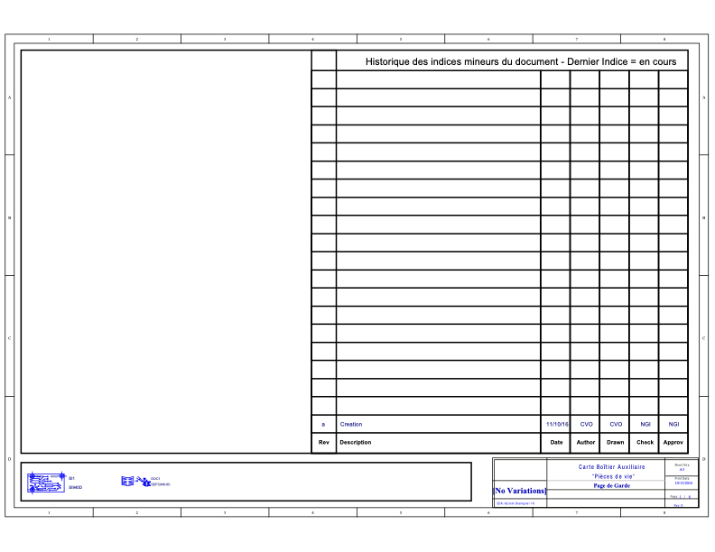

# Architecture Overview: Essensys SC940D Box

## 1. High-Level Description
The **SC940D** is a central control unit ("Boitier Pièce de Vie") designed for building automation. It acts as a gateway and actuator controller, managing lighting, blinds, and other AC loads via onboard relays.

> [Download Full Schematic PDF](assets/SC940D_Schematic.pdf)

## 2. Core Processing & Communication
### Microcontroller (MCU)
-   **Component**: Microchip **PIC16F946** (8-bit CMOS MCU).
-   **Package**: 64-pin TQFP (`PIC16F946-I/PT`).
-   **Role**: Handles local logic, relay control signals, and interfaces with the communication module. 
    -   *Note*: The PIC16F946 is an LCD-driver capable MCU, suggesting it might have been chosen for high pin count (64 pins) rather than LCD features, or legacy reasons.

### Communication Module ("Coeur")
-   **Component**: **SC943-0C** (Custom Module).
-   **Footprint**: `SI943C_REV_A`.
-   **Description**: Identified as a daughterboard module. Based on the "Essential" nature of the system, this likely handles RF communication (e.g., LoRa, Zigbee, or proprietary 868MHz).
-   **Interface**: Connected to the main PCB via headers.

## 3. Power Supply Chain
-   **Input Power**: 12V DC (Nominal, supplied via connector).
-   **Main Regulator**: **LMR12010YMK** (Texas Instruments).
    -   Type: Step-down (Buck) DC-DC Converter.
    -   Package: SOT-23-6.
    -   Efficiency: High efficiency (>85%) compared to linear regulators, suitable for minimizing heat in a closed enclosure.
-   **Protection**:
    -   **VDR1, VR2, VR3**: Varistors (`VDR_S10K_275` equivalent) for transient voltage suppression on mains/inputs.
    -   **SMF5V0A**: TVS Diodes for ESD/Surge protection on low-voltage signal lines.

## 4. Actuation & Interfaces
### Relay Outputs
The board features a high density of relays for switching loads:
-   **High Power Relays**: **Finder 40.61** Series (16A, SPDT). Used for main loads.
-   **Compact Relays**: **Finder 34.51** Series (6A, Ultra-slim). Used for lower power or space-constrained channels.
-   **Drivers**: **ZXMN3A01F** (N-channel MOSFETs) used to drive relay coils.

### Connectors / Terminals
-   Extensive use of **Phoenix Contact** vertical PCB terminal blocks (`FFKDS` series) for field wiring (Sensors, Bus, Power).
-   **HE10 / IDC**: `IDC2P54_26P` connector implies a 26-pin ribbon cable interface, possibly for programming, expansion, or front-panel connection.

## 5. PCB Technology
-   **Layers**: 4-Layer Board.
    -   **L1 (Top)**: Signals & Components.
    -   **L2 (G1)**: Internal Ground Plane (GND) - Critical for noise immunity.
    -   **L3 (G2)**: Internal Power Plane (VCC) - Likely split for 12V / 3.3V / 5V.
    -   **L4 (Bottom)**: Signals & secondary components.
