# Documentation du Firmware

Le firmware de la carte **SC940D** est développé en C pour le microcontrôleur **Microchip PIC16F946**.

## Environnement de Développement
- **Compilateur**: Hi-Tech C pour PIC10/12/16.
- **IDE**: MPLAB X (Fichier projet `essensys_ba.X`).
- **MCU**: PIC16F946.
- **Horloge**: Oscillateur High Speed (HS).
- **Watchdog**: Désactivé au démarrage (`WDTDIS`).

## Structure du Projet
Le code source se trouve dans `SC940D/Prog/code_ba (fichiers sources 1.7)/source/`.

| Fichier | Description |
| :--- | :--- |
| `main.c` | Point d'entrée, initialisation et gestion EEPROM. |
| `hard.c/h` | Couche d'Abstraction Matérielle (HAL). Définition des broches et I/O de bas niveau. |
| `gestionentrees.c` | Traitement des signaux d'entrée et anti-rebond. |
| `gestionsorties.c` | Logique de commande des sorties (Relais). |
| `variateur.c` | Algorithmes de contrôle des gradateurs ("Variateurs"). |
| `traitement.c` | Logique applicative principale et machine à états. |
| `slavenode.c` | Implémentation du protocole de communication (Bus I2C). |

## Cartographie Mémoire (EEPROM)
L'EEPROM est utilisée pour stocker la configuration persistante et l'état.

| Adresse | Description |
| :--- | :--- |
| `0x000D` | Version du Mapping EEPROM. |
| `0x000E-0F` | Vérification d'initialisation (`0xAA55`). |
| `0x0010-11` | État des Relais (LSB/MSB). |
| `0x0012-29` | Configuration Variateurs (Niveau actuel, Niveau sauvegardé, Mode). |
| `0x002A-31` | Temps d'action des Volets. |
| `0x0032-42` | Temps d'extinction des lampes. |

## Fonctionnalités Clés
1.  **Persistance d'État**: Les états des relais et niveaux des variateurs sont sauvegardés en EEPROM pour restaurer l'état après une coupure de courant.
2.  **Gestion des Entrées**: Traitement direct des entrées numériques avec anti-rebond.
3.  **Contrôle de Charge**:
    - **Relais**: Contrôle simple On/Off.
    - **Variateurs**: Contrôle de phase ou PWM pour l'éclairage.
    - **Volets**: Contrôle temporisé pour l'ouverture/fermeture des stores.
4.  **Communication**: Utilise un protocole "Nœud Esclave" propriétaire, via I2C pour communiquer avec le contrôleur central (`SC944D`).

## Adressage et Mapping des Entrées (Logique vs Physique)

Le firmware utilise des tables de correspondance statiques (définies dans `gestionentrees.c`) pour associer les **Entrées Logiques** (index utilisé par le protocole) aux **Broches Physiques** du microcontrôleur (`ENTREE0` à `ENTREE21`).

⚠️ **Attention** : Vous ne pouvez pas utiliser n'importe quelle broche d'entrée pour n'importe quelle fonction. L'assignation est fixée par la configuration logicielle de la carte (définie à la compilation par des `#define`).

Voici les mappings extraits du code source :

### Configuration `TYPE_CHAMBRES`
| Type Logique | Index Logique | Mapped sur Physique | Pin Physique (Est.) |
| :--- | :--- | :--- | :--- |
| **TOR** | 0 | `ENTREE0` | RB0 |
| **TOR** | 1 | `ENTREE2` | RF4 |
| **TOR** | 2 | `ENTREE3` | RF3 |
| **TOR** | 3 | `ENTREE9` | RG2 |
| **TOR** | 4 | `ENTREE10` | RG1 |
| **TOR** | 5 | `ENTREE14` | RD4 |
| **TOR** | 6 | `ENTREE18` | RC0 |
| **Variateur** | 0 | `ENTREE1` | RF5 |
| **Variateur** | 1 | `ENTREE8` | RG3 |
| **Variateur** | 2 | `ENTREE13` | RD5 |
| **Variateur** | 3 | `ENTREE17` | RD0 |
| **Volet** | 0 | `ENTREE4` | RF1 |
| **Volet** | ... | ... | ... |

*(Note : Les correspondances Pin/Port exactes dépendent de `hard.h`)*

Ce mécanisme confirme que même si les entrées `IN0` à `IN12` sont physiquement présentes sur le connecteur, elles ne seront "vues" par le firmware que si elles sont déclarées dans ces tables de mapping.

## Analyse de la Communication Maître-Esclave

La carte **SC940D** agit comme un module d'Entrée/Sortie esclave générique, piloté par un concentrateur maître (ex: **944D**).

### Protocole
- **Couche Physique**: I2C (basé sur le nommage `slavenode.c` et l'usage de `SSPBUF`).
- **Mécanisme**:
    1.  **Interruption**: `SSP_Handler` reçoit les octets bruts dans `RXBuffer`.
    2.  **Validation**: Un Checksum est calculé (`us_CalculerCRCSurTrame`). Si valide, les données sont copiées dans `CmdBuf`.
    3.  **Exécution**: La boucle principale appelle `vd_Traitement_I2C` qui traite `CmdBuf`.

### Diagramme de Flux (Logique Firmware)

```mermaid
graph TD
    subgraph Interrupt[Interruption - ISR]
        ISR(SSP_Handler) --> Recv[Réception Octet]
        Recv --> Buffer{"Buffer Plein ?"}
        Buffer -- Non --> Store[Stockage RXBuffer]
        Buffer -- Oui --> Checksum[Vérif. Checksum]
        Checksum -- Valide --> Copy[Copie vers CmdBuf]
        Checksum -- Invalide --> Error[Flag Erreur]
    end

    subgraph MainLoop[Boucle Principale]
        Start((Départ)) --> Init[Initialisation]
        Init --> Loop{"While(1)"}
        Loop --> Task1[vd_Traitement_I2C]
        Task1 --> CmdCheck{"CmdBuf[0] != 0?"}
        
        CmdCheck -- Oui --> Switch[Switch Commande]
        Switch --> C1[C_FORCAGE_SORTIES]
        Switch --> C2[C_CONF_SORTIES]
        Switch --> C3[C_TPS_EXTINCTION]
        
        C1 --> Action1[MàJ Relais/Variateurs]
        C2 --> Action2[MàJ Config & EEPROM]
        C3 --> Action3[MàJ Timers & EEPROM]
        
        Action1 --> Reset["CmdBuf[0] = 0"]
        Action2 --> Reset
        Action3 --> Reset
        
        Reset --> Loop
        CmdCheck -- Non --> Loop
    end
```

### Commandes du Protocole

| ID Commande | Nom | Description |
| :--- | :--- | :--- |
| `0x01` | `C_FORCAGE_SORTIES` | Force l'état des relais, variateurs ou volets. |
| `0x02` | `C_CONF_SORTIES` | Configure le mode variateur (On/Off ou Gradation). |
| `0x03` | `C_TPS_EXTINCTION` | Définit le temps d'extinction auto pour les lampes. |
| `0x04` | `C_TPS_ACTION` | Définit le temps de mouvement pour les volets. |
| `0x05` | `C_ACTIONS` | Déclenche des actions globales (ex: Sauvegarde État). |
