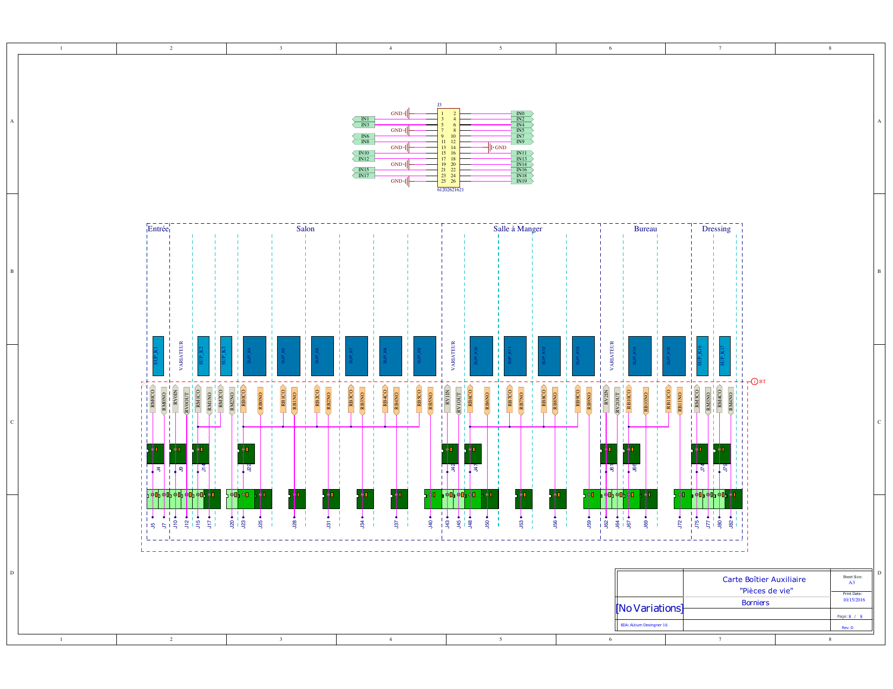

# Documentation SC940D

Bienvenue sur la documentation officielle de la carte **SC940D**, composant "Boitier Pièce de Vie" de la solution domotique Essensys Atrium.

## À propos du projet
La carte SC940D est une unité de contrôle centrale conçue pour l'automatisation du bâtiment. Elle agit comme une passerelle et un contrôleur d'actionneurs, gérant l'éclairage, les stores et d'autres charges CA via des relais embarqués.

Ce projet est Open Source Hardware. Vous trouverez ici toutes les informations nécessaires pour comprendre, fabriquer, réparer et intégrer cette carte.

## Aperçu du schéma
Pour vous donner un aperçu rapide, voici les éléments clés du circuit (Microcontrôleur et Connecteurs) :

*Figure 1: Schéma du cœur numérique (Microcontrôleur)*

*Figure 2: Schéma des connecteurs et interfaces*

## Contenu de la documentation

### 🏛️ Architecture
Comprenez le fonctionnement interne de la carte, son microcontrôleur PIC16F946 et son étage de puissance.
[➡️ Architecture Overview](Architecture_Overview.md)

### 🔌 Hardware
Détails techniques, recommandations de fabrication (DFM) et gestion de l'alimentation.
[➡️ Spécifications Hardware](hardware.md)

### 💾 Téléchargements
Accédez aux fichiers sources pour la production : schémas PDF, modèles 3D STEP et fichiers de fabrication Gerber.
[➡️ Espace de téléchargement](downloads.md)

## Structure du dépôt
Le code source et les fichiers de conception sont organisés comme suit :
- **SC940D/** : Dossier principal du projet (Hardware Altium).
    - **Schematics** : Schémas électroniques.
    - **PCB Layout** : Routage de la carte.
   - **Gerbers** : Fichiers de fabrication.
